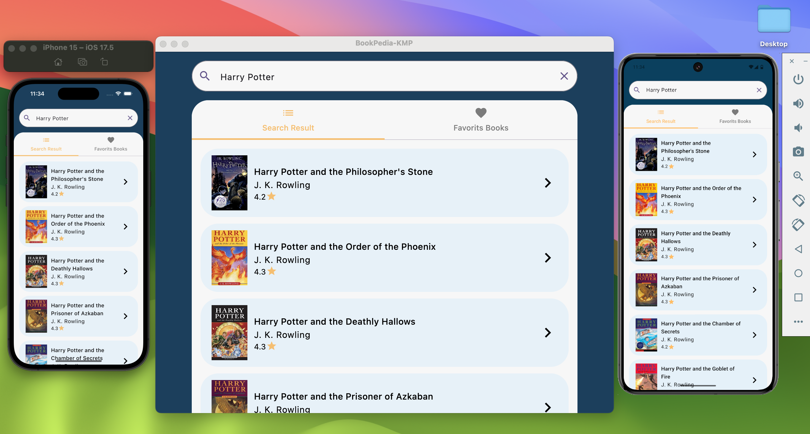
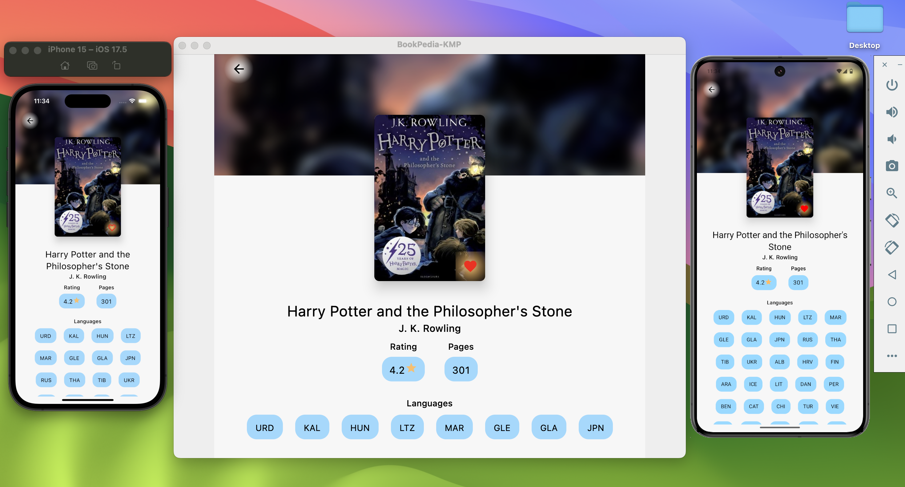

# BookPedia-KMP

BookPedia-KMP is a Kotlin Multiplatform application demonstrating a list and detail screen with features such as searching, displaying book information, and saving favorite books. The app uses **Kotlin Multiplatform** for cross-platform development with a focus on **Android**, **iOS**, and **Desktop**. It fetches book data from the [Open Library API](http://openlibrary.org/) and provides an interface to display book lists, view details, and mark books as favorites.

## Screens

### Book List Screen
- Displays a list of books.
- Tabs:
  - **Search Results**: Shows books fetched based on search keywords.
  - **Favorite Books**: Shows books saved to the local database as favorites.
- Search field at the top to search for books by keyword.

### Book List Screen



### Book Detail Screen
- Displays detailed information for a selected book, including:
  - Blurred image as header.
  - Book Cover image.
  - Book Title, Authors, Languages, and Description.
- Option to mark a book as a favorite, which saves it to the local database.

### Book Detail Screen


## Features
- **Cross-Platform**: Android, iOS, and Desktop.
- **Searchable Book List**: Fetch and display books based on search keywords.
- **Detail Screen**: View detailed information about a book including title, authors, languages, and description.
- **Favorites**: Mark books as favorites and save them to a local database. Favorite books are displayed in a separate tab.
- **Navigation**: Smooth navigation between screens using Jetpack Compose navigation.
- **Image Loading**: Efficient image loading for book covers using Coil.
- **Networking**: Fetch book data using Ktor for networking.
- **Local Database**: Store favorite books using Room.

## Technologies Used
- **Kotlin Multiplatform**: For sharing business logic and code across Android, iOS, and Desktop.
- **Jetpack Compose**: UI framework used for building the user interface on all platforms.
- **Ktor**: HTTP client for fetching book data from the Open Library API.
- **Room**: Local database for storing favorite books.
- **Coil**: Image loading library to display book cover images.
- **Kotlinx Serialization**: JSON parsing library to decode the API responses.

## Setup & Installation

To get started with BookPedia-KMP, follow these steps:

### Prerequisites
- **Android Studio** or another compatible IDE (like IntelliJ IDEA).
- **Xcode** (for iOS development).
- **JDK 11** or later.

### Steps

1. **Clone the repository**:

    ```bash
    git clone https://github.com/mik237/BookPedia-KMP.git
    cd BookPedia-KMP
    ```

2. **Open the project**:
  - If you are using **Android Studio**, open the `BookPedia-KMP` folder as a project.
  - For **iOS** development, make sure you have Xcode installed and set up for iOS development.
  - For **Desktop**, ensure you have a Java runtime environment installed.

3. **Install dependencies**:
  - Sync the project to download dependencies via Gradle.

4. **Run the app**:
  - For **Android**: Select the Android target and run it on an emulator or device.
  - For **iOS**: Use Xcode to build and run on an iOS device or simulator.
  - For **Desktop**: Run the desktop version as a Java application.

## Architecture
- **Kotlin Multiplatform** is used to share code across platforms.
- **Model-View-Intent (MVI)** architecture is used to separate concerns:


## Dependencies

- `androidx.compose.ui:ui`
- `androidx.compose.material:material`
- `androidx.navigation:navigation-compose`
- `io.ktor:ktor-client-core`
- `io.ktor:ktor-client-json`
- `io.ktor:ktor-client-serialization`
- `io.coil-kt:coil-compose`
- `androidx.room:room-runtime`
- `org.jetbrains.kotlinx:kotlinx-serialization-json`
- `androidx.activity:activity-compose`


## Contribution

If you’d like to contribute to BookPedia-KMP, feel free to fork the repository and create a pull request with your changes. Before submitting a pull request, ensure that the following steps are followed:
- Add tests to cover new features or bug fixes.
- Ensure that the app runs on all supported platforms (Android, iOS, and Desktop).

## License

This project is licensed under the MIT License - see the [LICENSE](LICENSE) file for details.

## Contact

For any issues or feedback, feel free to open an issue on the GitHub repository or contact me directly.

---

### Acknowledgements
- [Open Library API](http://openlibrary.org/) for providing the book data.
- [Jetpack Compose](https://developer.android.com/jetpack/compose) for the UI framework.
- [Kotlin Multiplatform](https://kotlinlang.org/docs/multiplatform.html) for cross-platform development.
- [Ktor](https://ktor.io/) for networking.
- [Coil](https://coil-kt.github.io/coil/) for image loading.


This project is based on the implementation from a YouTube video by the famous YouTuber **Philipp Lackner**. His tutorial was a great resource and inspiration for this Kotlin Multiplatform application.

You can watch the original video here: [Kotlin Multiplatform Project Tutorial by Philipp Lackner](https://youtu.be/WT9-4DXUqsM?si=kcW3kvHsX_rnEJq5)

I would like to express my sincere thanks to Philipp Lackner for his excellent content and for contributing to my learning journey!

---

Thank you for using BookPedia-KMP! 🎉

